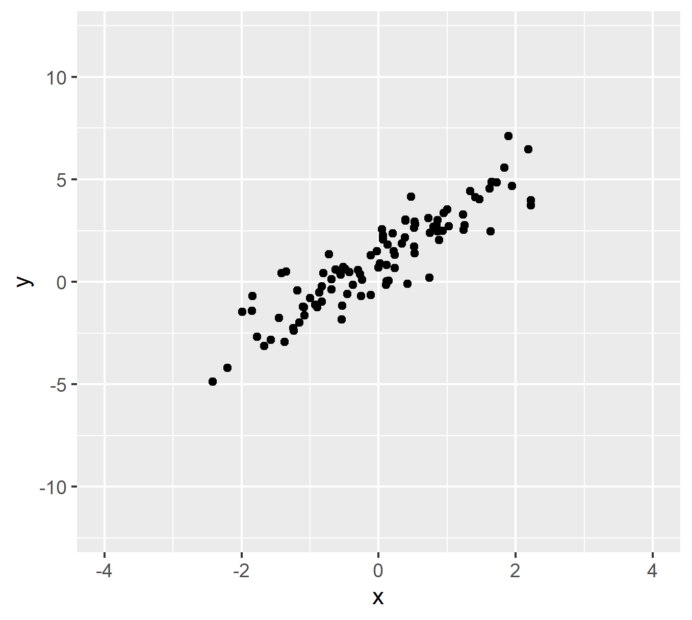

```{r,include=F}
options(width=60)
knitr::opts_chunk$set(fig.align='center',fig.width=9,fig.height=5)
```

---

# Agenda

- Machine Learning Algorithms

- Mapping in `R` (time permitting)


---

# What is regression?

--

- Conditional means for continuous data

--

<center></center>

---

# What is regression?

- .blue[Theory]: the more you earn, the more you spend

<center></center>

---

# What is regression?

- But **conditional means** make a lot of mistakes. Can we do better?

<center></center>


---

# What is regression?

- But **conditional means** make a lot of mistakes. Can we do better?

<center></center>


---

# Regression

--

- Calculating a **line** that minimizes mistakes *for every observation*

--

  - NB: could be a curvey line! For now, just assume straight
  
--

- Recall from geometry how to graph a straight line

--

- $Y = a + bX$

  - $a$: the "intercept" (where the line intercepts the y-axis)
  - $b$: the "slope" (how much $Y$ changes for each increase in $X$)

--

- (Data scientists use $\alpha$ and $\beta$ instead of $a$ and $b$ b/c nerds)

--

- Regression analysis simply chooses the best line

--

  - "Best"?

--

  - The line that minimizes the mistakes (the **line of best fit**)

---

# Visual Intuition

<center></center>


---

# Visual Intuition

<center></center>

---

# Regression

--

- The line is .blue[substantively meaningful]

--

- Red line on scatter plot of spending and wages: $Y = 12 + 2*X$

--

- $\alpha$ tells us the value of $Y$ when $X$ is zero

--

  - People who don't make any money spend $12 per week on entertainment
  
--

- $\beta$ tells us how much $Y$ increases for each additional $X$

--

  - People spend an additional $2 per week for each additional $1 in hourly wages
  
---

# Two Camps Revisited

--

- Regression is great for **theory testing**

--

  - Results tell us something **meaningful** about our theory
  
--

- But if all we care about is **prediction**...?

--

  - Want to test every possible predictor (and combinations)
  
  - Don't care about **relationships**
  
  - Just care about **accuracy**
  
--

- Algorithms can save us time!

--

  - Random Forests
  
  - LASSO
  
---

# Random Forests

- Identify the best "partition" (split) that divides the data

--

<center></center>

--

- In `R`: `ranger`

--

  - `formula = Y ~ .`

---

# Random Forests

```{r,message = FALSE}
require(tidyverse)
covidData <- read_rds('../data/covid_prepped.Rds')
glimpse(covidData)
```

---

# Research Question

- What predicts the Covid-19 death rate by county?

```{r}
form.demogs <- 'covid.death.rate ~ perc.65up + perc.male + perc.non.hisp.white + perc.non.hisp.black + perc.non.hisp.asian + perc.hispanic + log.pop'

form.econ <- 'covid.death.rate ~ perc.65up + perc.male + perc.non.hisp.white + perc.non.hisp.black + perc.non.hisp.asian + perc.hispanic + log.pop + lfpr + weekly.wages + unemp.rate + perc.manuf + perc.rural'

form.pol <- 'covid.death.rate ~ perc.65up + perc.male + perc.non.hisp.white + perc.non.hisp.black + perc.non.hisp.asian + perc.hispanic + log.pop + lfpr + weekly.wages + unemp.rate + perc.manuf + perc.rural + perc.trump.2016'
```

---

# Comparing models

```{r}
m.demogs <- lm(as.formula(form.demogs),covidData)
summary(m.demogs)
```

---

# Comparing models

```{r}
m.econ <- lm(as.formula(form.econ),covidData)
summary(m.econ)
```

---

# Comparing models

```{r}
m.pol <- lm(as.formula(form.pol),covidData)
summary(m.pol)
```

---

# Evaluate Model Fit

```{r}
cvRes <- NULL
for(i in 1:100) {
  inds <- sample(1:nrow(covidData),size = round(nrow(covidData)*.8),replace = F)
  train <- covidData %>% slice(inds)
  test <- covidData %>% slice(-inds)
  
  # Train
  mTmp.demogs <- lm(as.formula(form.demogs),train)
  mTmp.econ <- lm(as.formula(form.econ),train)
  mTmp.pol <- lm(as.formula(form.pol),train)
  
  # Test
  tmp <- test %>%
    mutate(pred.d = predict(mTmp.demogs,newdata = test),
           pred.e = predict(mTmp.econ,newdata = test),
           pred.p = predict(mTmp.pol,newdata = test)) %>%
    summarise(rmse.d = sqrt(mean((covid.death.rate - pred.d)^2)),
              rmse.e = sqrt(mean((covid.death.rate - pred.e)^2)),
              rmse.p = sqrt(mean((covid.death.rate - pred.p)^2))) %>%
    mutate(cvIndex = i)
  
  cvRes <- cvRes %>%
    bind_rows(tmp)
}
```

---

# Evaluate Model Fit

```{r}
cvRes %>%
  gather(metric,rmse,-cvIndex) %>%
  ggplot(aes(x = rmse,y = metric)) + 
  geom_boxplot()
```

---

# Random Forests

```{r,message = FALSE}
require(ranger) # Fast random forests package
m.all <- ranger(formula = as.formula(form.demogs),data = covidData)
m.all
```

---

# Random Forest Comparison

```{r}
cvRes <- NULL
for(i in 1:100) {
  inds <- sample(1:nrow(covidData),size = round(nrow(covidData)*.8),replace = F)
  train <- covidData %>% slice(inds)
  test <- covidData %>% slice(-inds)
  
  # Train
  mLM.p <- lm(as.formula(form.pol),train)
  mRF.p <- ranger(as.formula(form.pol),train)
  
  # Test
  # NEED TO RUN PREDICTION ON RF FIRST
  tmpPred <- predict(mRF.p,test)
  
  tmp <- test %>%
    mutate(pred.lm = predict(mLM.p,newdata = test),
           pred.rf = tmpPred$predictions) %>%
    summarise(rmse.lm = sqrt(mean((covid.death.rate - pred.lm)^2)),
              rmse.rf = sqrt(mean((covid.death.rate - pred.rf)^2))) %>%
    mutate(cvIndex = i)
  
  cvRes <- cvRes %>%
    bind_rows(tmp)
}
```

---

# Random Forest Comparison

```{r}
cvRes %>%
  gather(metric,rmse,-cvIndex) %>%
  ggplot(aes(x = rmse,y = metric)) + 
  geom_boxplot()
```

---

# What matters most?

- Random Forests are particularly suitable for investigating **variable importance**

--

  - I.e., which $X$ predictors are most helpful?
  
--

- A few options, but we rely on **permutation tests**

--

  - Idea: run the best model you have, then re-run it after "permuting" one of the variables
  
  - "Permute" means randomly reshuffle...breaks relationship
  
  - How much **worse** is the model when you break a variable?
  
---

# Variable Importance

- In `ranger()`, use `importance = "permutation"`

```{r}
rf.pol <- ranger(formula = as.formula(form.pol),data = covidData,importance = 'permutation')

rf.pol$variable.importance
```

---

# Variable Importance

```{r}
toplot <- data.frame(vimp = rf.pol$variable.importance,
                     vars = names(rf.pol$variable.importance))

toplot %>%
  ggplot(aes(x = vimp,y = reorder(vars,vimp))) + 
  geom_bar(stat = 'identity')
```


---

# LASSO

--

- "Least Absolute Shrinkage and Selection Operator"

--

- Concept: Make it hard for predictors to matter

--

  - Practice: $\lambda$ penalizes how many variables you can include
  
  - $\sum_{i = 1}^n (y_i - \sum_j x_{ij}\beta_j)^2 + \lambda \sum_{j=1}^p |\beta_j|$
  
  - Minimize the errors, but penalize for each additional predictor
  
  - You *could* kitchen-sink a regression and get super low errors
  
  - LASSO penalizes you from throwing everything into the kitchen sink

--

- In `R`, need to install a new package! `install.packages('glmnet')`

```{r,message = FALSE}
require(glmnet)
```

---

# LASSO

- Function doesn't use formulas

--

- Give it the raw data instead, divided into `Y` (outcome) and `X` (predictors)

--

```{r}
Y <- covidData$covid.death.rate
X <- covidData %>% select(perc.65up,perc.male,perc.non.hisp.white,perc.non.hisp.black,perc.non.hisp.asian,perc.hispanic,log.pop,lfpr,weekly.wages,unemp.rate,perc.manuf,perc.rural,perc.trump.2016)
```


---

# LASSO

- Now estimate!

```{r}
lassFit <- glmnet(x = as.matrix(X),
                  y = as.matrix(Y))
```

---

# LASSO

```{r}
plot(lassFit)
```

---

# Has its own CV!

```{r}
cv.lassFit <- cv.glmnet(x = as.matrix(X),y = as.matrix(Y))

plot(cv.lassFit)
```

---

# Variable Importance

```{r}
best <- cv.lassFit$glmnet.fit$beta[,cv.lassFit$index[2,]]
vimpLass <- data.frame(vimp = best,
                       vars = names(best))
vimpLass %>%
  ggplot(aes(x = vimp,y = reorder(vars,vimp))) + 
  geom_bar(stat = 'identity')
```

---

# Maps

- Install `maps`

```{r,message = F,warning = F}
require(tidyverse)
require(maps)
require(mapproj)

# Load dataset included in maps package
states48 <- map_data('state')

states48 %>%
  as_tibble()
```

---

# Maps

- `maps` data are prepared to run with `ggplot()`

--

  - Specifically, want to use `geom_polygon()`
  
--

```{r}
p <- states48 %>%
  ggplot() + 
  geom_polygon(aes(x = long,y = lat,group = group),
               color = 'black',
               fill = 'lightblue')
```

---

# Maps

```{r}
p
```

---

# Maps

- Can quickly improve with pre-made `theme()`s and `coord()`s

--

```{r}
p + 
  theme_void() + 
  coord_map('albers',lat0 = 30,lat1 = 40)
```

---

# Maps

- Can zoom in with `filter()`

--

```{r}
ny <- states48 %>%
  filter(region == 'new york')

pNY <- ny %>%
  ggplot() + 
  geom_polygon(aes(x = long,y = lat,group = group),
               color = 'black',
               fill = 'grey85') + 
  theme_void()
```

---

# Maps

```{r}
pNY
```

---

# Maps

```{r}
pNY + 
  coord_map('albers',lat0 = 30,lat1 = 40)
```

---

# Maps

- Can also get counties prepared!

```{r}
counties <- map_data('county')

pCty <- counties %>%
  ggplot() + 
  geom_polygon(aes(x = long,y = lat,group = group),
               color = 'black',
               fill = 'grey90') + 
  theme_void() + 
  coord_map('albers',lat0 = 30,lat1 = 40)
```

---

# Maps

```{r}
pCty
```

---

# Maps

```{r}
pNYCty <- counties %>%
  filter(region == 'new york') %>%
  ggplot() + 
  geom_polygon(aes(x = long,y = lat,group = group),
               color = 'black',
               fill = 'grey90') + 
  theme_void() + 
  coord_map('albers',lat0 = 30,lat1 = 40)
```

---

# Maps

```{r}
pNYCty
```

---

# Maps

- Want to visualize data!

--

- Put the `fill` inside the `aes`

--

- But we need data first

--

```{r}
JBStates <- c('new york','california','vermont','massachusetts','district of columbia','tennessee','connecticut')

states48 <- states48 %>%
  mutate(jbLived = ifelse(region %in% JBStates,'Lived','Never lived'))
```

---

# Maps

```{r}
p <- states48 %>%
  ggplot() + 
  geom_polygon(aes(x = long,y = lat,group = group,fill = jbLived),
               color = 'black',alpha = .6) + 
  theme_void() + 
  coord_map('albers',lat0 = 30,lat1 = 40)
```

---

# Maps

```{r}
p + 
  scale_fill_manual(name = '',values = c('Lived' = 'darkgreen','Never lived' = 'grey95')) + 
  labs(title = "Places I've Lived in the U.S.")
```

---

# Maps

- Also have world maps!

```{r}
JBCountries <- c('USA','South Korea','France','UK',
                 'Germany','Switzerland','Greece',
                 'Dominican Republic','Saint Lucia',
                 'China','Thailand','Cambodia','Japan',
                 'Guatemala','Aruba','Canada','Belize','Mexico')
world <- map_data('world')

world <- world %>%
  mutate(jbVisit = ifelse(region %in% JBCountries,'Visited','Never been'))

p <- world %>%
  ggplot() + 
  geom_polygon(aes(x = long,y = lat,group = group,fill = jbVisit),
               color = 'black',alpha = .6) + 
  theme_void()
```

---

# Maps

```{r}
p + 
  scale_fill_manual(name = '',values = c('Visited' = 'darkgreen','Never been' = 'grey95')) + 
  labs(title = "Places I've Visited")
```

---

# Maps

- More interesting data?

--

```{r}
PollDat <- readRDS('../data/PresStatePolls04to20.Rds') %>%
  as_tibble() %>%
  rename(region = state.name)

PollDat %>% head()
```

---

# Maps

- Collapse to state-by-year

--

```{r}
PollDat <- PollDat %>%
  group_by(year,region) %>%
  summarise(DemPct = mean(dem.poll,na.rm=T),
            RepPct = mean(rep.poll,na.rm=T),
            DemVote = first(dem.vote),
            RepVote = first(rep.vote)) %>%
  ungroup()
```

---

# Maps

- Merge with map data

--

```{r}
toplot <- states48 %>%
  left_join(PollDat %>%
              filter(year == 2020))

p <- toplot %>%
  ggplot() + 
  geom_polygon(aes(x = long,y = lat,group = group,fill = DemPct),
               color = 'black') + 
  theme_void() + 
  coord_map('albers',lat0 = 30,lat1 = 40)
```

---

# Maps

```{r}
p
```

---

# Maps

- Let's adjust with `scale_fill_continuous()`

```{r}
p + 
  scale_fill_continuous(name = 'Biden %',low = 'red',high = 'blue')
```

---

# Maps

- Could also `cut` to create bins

```{r}
p + 
  scale_fill_stepsn(colors = c('darkred','red','tomato','grey80','skyblue','blue','darkblue'),
                    breaks = c(30,35,40,49,51,60,65,70))
```

---

# Maps

- Different geographies & different data

```{r}
countycovid <- readRDS('../data/countycovid.Rds') # Already prepared!

p <- countycovid %>%
  ggplot() + 
  geom_polygon(aes(x = long,y = lat,group = group,fill = deaths),
               color = 'grey90') + 
  theme_void() + 
  coord_map('albers',lat0 = 30,lat1 = 40)
```

---

# Maps

```{r}
p + 
  scale_fill_continuous(name = 'Deaths',low = 'white',high = 'red')
```

---

# Maps

- Raw deaths are a bad measure...why?

--

- Want to normalize by population!

```{r}
p <- countycovid %>%
  ggplot() + 
  geom_polygon(aes(x = long,y = lat,group = group,
                   fill = deaths*100000/population)) + 
  theme_void() + 
  coord_map('albers',lat0 = 30,lat1 = 40)
```

---

# Maps

```{r}
p + 
  scale_fill_continuous(name = 'Deaths (per 100K)',
                        low = 'white',high = 'red')
```

---

# Maps

- What about more precise things?

--

- I.e., where I've lived by county

```{r}
jbCounties <- c('norfolk:massachusetts','washington:vermont',
                'manhattan:new york','san francisco:california',
                'davidson:tennessee','hartford:connecticut',
                'washington:district of columbia')

counties <- counties %>%
  mutate(combReg = paste0(subregion,":",region)) %>%
  mutate(jbLived = ifelse(combReg %in% jbCounties,'Lived',
                          'Never lived'))

p <- counties %>%
  ggplot() + 
  geom_polygon(aes(x = long,y = lat,group = group,
                   fill = jbLived)) + 
  theme_void() + 
  coord_map('albers',lat0 = 30,lat1 = 40)
```

---

# Maps

```{r}
p
```

---

# Maps

- Can add points instead!

--

```{r,message = F,warning = F}
jbLivedDF <- data.frame(combReg = jbCounties,
                        years = c(18,18,7,1,.4,3,4))

counties <- counties %>% left_join(jbLivedDF)

p <- counties %>%
  ggplot() + 
  geom_polygon(aes(x = long,y = lat,group = group),
               fill = 'grey95',color = 'grey70') + 
  geom_point(data = counties %>%
               drop_na(years) %>%
               group_by(group,years) %>%
               summarise(long = mean(long),lat = mean(lat)),
             aes(x = long,y = lat,size = years),shape = 21,color = 'red') + 
  theme_void() + 
  scale_size_continuous(range = c(2,10),breaks = c(1,5,10)) + 
  coord_map('albers',lat0 = 30,lat1 = 40)
```

---

# Maps

```{r}
p
```


